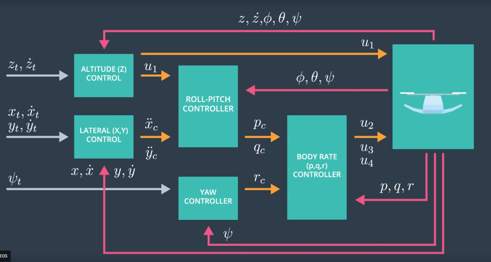
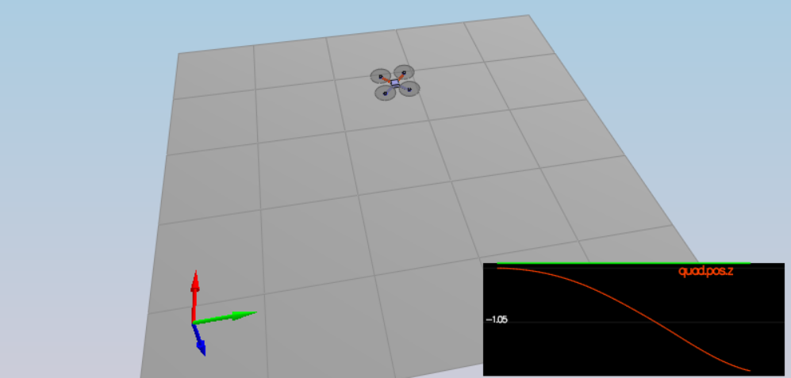

# 3D Control of a Quadrotor #

### Control Architecture ###


The high level control architecture is given by

<p align="center">

</p>

The inner control loops operate at higher frequency compared to the outer loops.

### Hover ###

The following code implements the equations of motion described earlier in the 3D control lesson.

<p align="center">

</p>

where `c_bar`, `p_bar`, `q_bar`, `r_bar` are represented by

<p align="center">

</p>


The quadrotor is able to hover successfully and passes the specification.

```console
PASS: ABS(Quad.PosFollowErr) was less than 0.500000 for at least 0.800000 seconds
```
<p align="center">

</p>

### Body Rate Control ###

The body rate controller  gets `commanded` and `actual` angular velocities in Body Frame `p_c`, `q_c` and `r_c` as input and generates as output the Moments about the 3 axes.

Since a proportional controller is used, the code to perform this operation is provided below -

```cpp
  V3F I;
  I.x = Ixx;
  I.y = Iyy;
  I.z = Izz;
  momentCmd = I * kpPQR * (pqrCmd - pqr);
```
A value of `~4x` of the default specified was needed for the KpPQR for the Roll and Pitch axes for it to pass the specification.

### Roll/Pitch Control ###

This controller gets the commanded thrust, and the current Euler angles in the Inertial frame and puts out the commanded Roll and Pitch angular velocities in the Body Frame.

The equations to convert the commanded thrust values from Interial Frame to Body Frame are done using the Rotational Matrix using the equations shown below -

<p align="center">

</p>

These equations are represented in the code below in the function
`RollPitchControl()`.

```cpp
float c = collThrustCmd / mass;
	float b_x_cmd, b_y_cmd = 0.0;

	if (collThrustCmd > 0) {
		 b_x_cmd = -CONSTRAIN(accelCmd.x / c, -maxTiltAngle, maxTiltAngle);
		 b_y_cmd = -CONSTRAIN(accelCmd.y / c, -maxTiltAngle, maxTiltAngle);
	}

	float b_x_err = b_x_cmd - R(0, 2);
	float b_x_p_term = kpBank * b_x_err;

	float b_y_err = b_y_cmd - R(1, 2);
	float b_y_p_term = kpBank * b_y_err;

	pqrCmd.x = (R(1, 0) * b_x_p_term - R(0, 0) * b_y_p_term) / R(2, 2);
	pqrCmd.y = (R(1, 1) * b_x_p_term - R(0, 1) * b_y_p_term) / R(2, 2);

```

The output of the attitude control scenario works as expected after Body Rate Control and Roll/Pitch Control are implemented.

```console
PASS: ABS(Quad.Roll) was less than 0.025000 for at least 0.750000 seconds
PASS: ABS(Quad.Omega.X) was less than 2.500000 for at least 0.750000 seconds
```

### Position Control ###

Position control consists of two components
- Altitude Control implemented in the function `AltitudeControl()`
- XY Control implemented in the function `LateralPositionControl()`

The implementation of the PID controller for `AltitudeControl()` is shown below -

```cpp
float b_z = R(2, 2);
	float z_err = posZCmd - posZ;
	float pos_term = kpPosZ * z_err;
	integratedAltitudeError += z_err * dt;

	velZCmd = CONSTRAIN(velZCmd + pos_term, -maxAscentRate, maxDescentRate);  // Keep NED frame directions in mind

	thrust = -(kpVelZ * (velZCmd - velZ) + KiPosZ * integratedAltitudeError + accelZCmd - CONST_GRAVITY) * mass / b_z ;
```
Similarly the `LateralPositionControl()` for XY control uses a PD controller whose equation is

<p align="center">

</p>

 The code which implements the equation is provided above with the added feature of checking for max velocity and acceleration in the XY direction.

```cpp
//Velocity Term
	velCmd = velCmd + kpPosXY * (posCmd - pos);

	if (velCmd.mag() > maxSpeedXY)
	{
		velCmd = velCmd.norm() * maxSpeedXY;
	}

	// Acceleration term with Feed Forward Component
	accelCmd += kpVelXY * (velCmd - vel);
	if (accelCmd.mag() > maxAccelXY)
	{
		accelCmd = accelCmd.norm() * maxAccelXY ;
	}
```

### Yaw Control ###

Yaw control uses a simple proportional controller

`r_c = kp_yaw * (psi_c - psi)`

The code shown below implements the above control equation along with taking care that `psi` does not go out of range of `[-pi, pi]`.

```cpp
float yaw_err = yawCmd - yaw;

	// Use hint to get the error within the right radian angle range
	yaw_err = fmodf(yaw_err, M_PI*2.f);
	if (yaw_err > M_PI)
	{
		yaw_err -= 2.f * M_PI;
	}
	else if (yaw_err < -M_PI)
	{
		yaw_err += 2.f * M_PI;
	}
	yawRateCmd = yaw_err * kpYaw;
```

Both scenario 3

```console
PASS: ABS(Quad1.Pos.X) was less than 0.100000 for at least 1.250000 seconds
PASS: ABS(Quad2.Pos.X) was less than 0.100000 for at least 1.250000 seconds
PASS: ABS(Quad2.Yaw) was less than 0.100000 for at least 1.000000 seconds
```

and scenario 4 specifications were met -

```console
PASS: ABS(Quad1.PosFollowErr) was less than 0.100000 for at least 1.500000 seconds
PASS: ABS(Quad2.PosFollowErr) was less than 0.100000 for at least 1.500000 seconds
PASS: ABS(Quad3.PosFollowErr) was less than 0.100000 for at least 1.500000 seconds
```

## Acknowledgements ##

Thanks to Fotokite for the initial development of the project code and simulator.

A lot of the changes incorporated here are based on the discussions and prior questions in the forums. 
